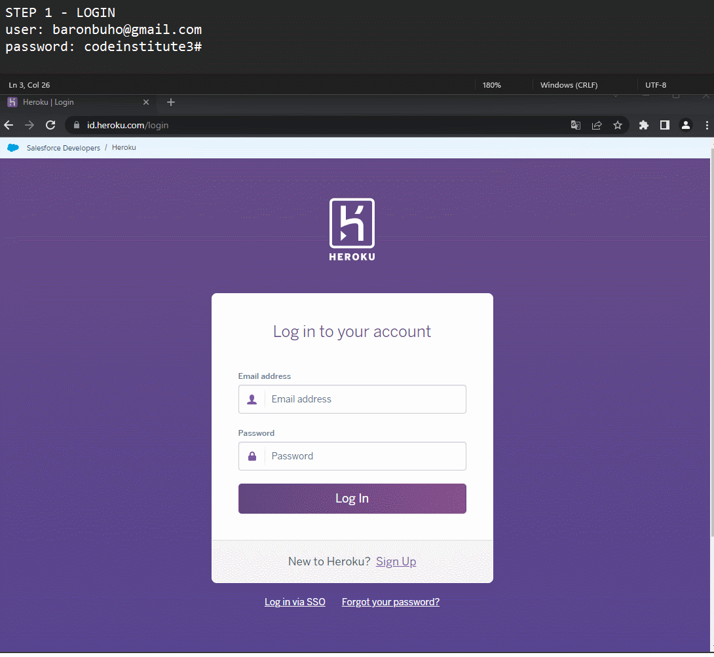

<h1 align="center">Pro3</h1>

<div align="center">


</div>

 <p align="center">
    A virtual tutor to learn Spanish
    <br />
	  Get your keyboard ready and let's get started!
    <br />
  </p>

<div align="center">

> Try, Fail, Fix, Hit (TFFH), as in real life.

> [DEPLOY LINKS!](#deploy)
</div>

<hr />

### 🧐About

Pro3 has been created with the purpose of memorizing the main Spanish vocabulary and phrases in the most effective way, keeping the focus on memorizing without the possibility of losing concentration.

There are other options on the market, but the main task of Pro3 is to keep you fully focused on correctly typing the answer the first consecutive times or else you will constantly fail, unlike other applications where you just need to choose one option from the proposals, where cheating is encouraged

### 🎈Usage


-   Read the sentence. Write translation. Pulse enter
-   To get the most out of it, write the translation as fast as possible. It is better to miss 9 times but hit 3 than to hit 6 taking twice as long. Depending on your performance it will become easier or more difficult, so don't force yourself, let your mind and your keyboard do everything for you.
-   Progress is saved automatically so don't worry about anything else to learn

### 📚Prerequisite

-   Python 3

---

### 🧰 Commands


-   ``-showall`` Get all sentences/answers
-   ``-showremain`` Get all remaining sentences/answers
-   ``-showstudy`` Get all inProgress sentences/answers
-   ``-showlearn`` Get all learned sentences/answers
-   ``-reset`` All advances are removed
-   ``-exit`` Leave Pro3
-   ``-help`` Get all commands

---

### 📝Todo

Functions for managing and searching for words and phrases will be added soon. The speed and ease of use will also be improved by adding a shortcut, as well as shortkeys

-   Add Direct Access
-   Add search functionality

---

### 📈Future Plans

In the future the language will be changed to java to be compatible with related projects, and add new features.

-   Do it in java language
-   Competition mode
-   Race mode
-   Analytics
	
---

### 💡How pro-3 works

#### STEP A: Import, export and transforming csv and decks data formats
##### 1. Read startingCSV
##### 2. Extract data from starting.csv and insert in auxiliarDeck
##### 3. Transform format in auxiliarDeck and insert in park.csv
##### 4. Extract first capsule from park.csv and insert in race.csv
- To have a first to start from
- Capsule is a section data composed by two lines
- First line contains fuel, tank and auxiliar value. Fuel value indicate your corresponding capsule level. Tank value indicate your capacity to achieve more level in corresponding capsule. Auxiliar value is reserved for future utilities (deep value, indicates if the capsule is out of your level)
- Second line contains sentence and answer data
- Capsule example:
	````
	2,4,0
	run, correr
	````
#### STEP B: Initiate while loop
##### 5. Ask capsule
- Request previous failure data (You have to answer the first one correctly)
##### 6. Ask sentence
- Print sentence in console
##### 7. Ask answer
- Request answer (Get answer in a variable named answerRequest)
##### 8. Exam answer
- Compare answerRequest value with actual capsule sentence value
- If they match, return "Correct", if not, return "Incorrect"
##### 9. Examination action
- If its incorrect and if it has no previously failed, decrease fuel value and ask answer again (start loop again from there) 
- If its incorrect and if it has previously failed, ask answer again without decrease fuel value (Fuel value decrese once per exam)
	
##### 10. But, if its correct: Go to successfulAnswerAction
- If it has previously failed, increase fuel value
- If it has previously failed, continue without increase fuel value (You have to answer the first one correctly)
##### 11. Exam capsule movement
- Capsules are arranged according to fuel
- If the fuel is increased, the order changes
##### 12. Order capsules
##### 13. Adjust fuel
- Decrease in 1 all capsule fuel values
##### 14. Exam capsule movement
- If after this the fuel value of any capsule is +12, the capsule go to win.csv
- This means that you have answered capsule correctly considerable times
- Means you have reached the maximum level in that capsule
##### 15. Update all changes by exporting from deck to csv files
##### 16. The loop start again

---
		
### Deploy links<a name="deploy"></a>
* Zero Option: Heroku.com (live) [Why not keroku?](#whyNotHeroku)
  * Alternative 0: https://pro3-1sabe.herokuapp.com/ 
    * (if it doesn't work choose Alternative 1: Direct Access)
  * Alternative 1: Direct Access
    * STEP 1: LOGIN
      * Go to https://id.heroku.com/login
      * User: baronbuho@gmail.com
      * Password: codeinstitute3#
    * 
    
    * STEP 2: ACCESS THE BASH OF OUR APP
    * 
    
    * STEP 3: RUN OUR APP
      * execute: ``python pro3-1.py``
    * 
    
* First Option: Gitpod.io (live)
  * Alternative 2: https://gitpod.io/start/#franky3553-pro31-4wg3crk4si9
  * Alternative 3: https://gitpod.io/start/#amethyst-cod-et2yt3l2i5n
	
* Second Option: Replit.com
  * Alternative 4: https://replit.com/@juan-francisc38/pro3-1?v=1
	
* Third Option: Pythonanywhere.com
  * Alternative 5: https://www.pythonanywhere.com/user/franky3553/shares/509bd5fbd3d54be5967184e684dd45af/

* Fourth option: Manually (Alternative 6)
  1. Download this repo
  2. Open file in your terminal
  3. Execute: ``python pro3-1.py``

---

#### Why not Heroku?<a name="whyNotHeroku"></a>

*(Now pro3-1 is deployed in heroku, but it is more difficult to use because it is a terminal app)*

I had problems connecting to heroku.com. After several time I have run into this recursive error:

``
at=error code=H14 desc="No web processes running" method=GET path="/" host=glacial-mesa-48481.herokuapp.com request_id=681cbb73-4404-4e42-babf-2e8aa970ba83 fwd="47.62.72.45" dyno= connect= service= status=503 bytes= protocol=https
``

Meanwhile tried on other alternative platforms, specifically on:
1. Railway.app
2. Cyclic.sh
3. Render.com
4. Deta.sh
5. Glitch.com
6. Fly.io

I have had different errors in each of them. I suspect it is due to the lack of web interface in my app and the use of .csv files. I'm still looking for a more efficient solution.

I finally solved it! How?:

1. In myMainApp folder, Create "Procfile" file and not "procfile.txt"
2. In Procfile, add ``worker: python pro3-1.py``, and not ``worker python pro3-1.py``
3. In myMainApp folder, Create "requirements.txt" file
4. Insert my App requirements exe ``pip freeze > requirements.txt``
5. In myMainApp folder, Create "runtime.txt" file
6. In runtime.txt, add ``python-3.10.4`` because my original python version (python 3.10.8) doesn't work on heroku 22
7. Fix sintax error in runtime.txt: Python 3.10.4 -> python-3.10.4
8. Fixing heroku branches specifications: chaos in migrates, main and master checkouts etc

So, now pro3-1 is deployed in heroku, but it is more difficult to use because it is a terminal app. Because of this i have created more alternatives on the following plattforms:

1. Gitpod.io
2. Replit.com
3. Pythonanywhere.com

..which have been exposed in the [Deploy Links!](#deploy) section (Alternatives 2 to 5)

---

### 👋End Note

It has been a pleasure developing this project.
I hope you enjoy learning Spanish!	


